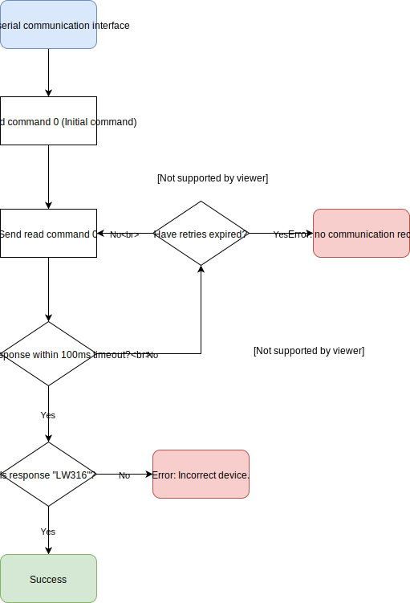

<!--  -->

# LW316 documentation

## 1. Version support
Hardware and firmware versions of the LW316 that this document applies to:

|Product|Hardware|Firmware|Supported|
|----|--------|--------|:-------:|
|LW316|0       |0.0.0   |-       |
|LW316|0       |0.1.0   |-       |
|LW316|0       |0.2.0   |Yes     |

## 2. Communication workflow

### 2.1 Overview

The LW316 has two methods of communication, a binary packet interface over serial uart and a register based I2C interface.

When the LW316 first receives power it will enter a neutral interface mode. Sending an initial command over either serial or i2c will indicate which interface to activate. This first command will not get a response. I recommend doing a read for the product name (Command ID 0) until the appropriate response is received, at which point you can be guaranteed that correct interface has been activated.

Read vs Writing



### 2.2 Serial interface

3V to 5V compat? The LW316 has a fixed Baudrate of 921600, which is required for the data streaming. Future versions of firmware will allow a selectable baud rate.
Use packets to communicate, see: 

Communication over this interface is strictly done with encapsulated packets.

Request/response vs streaming.
Reading and writing are set with a bit in the binary request packet.

### 2.3 I2C interface

The LW316 does not automaticaly increment the register address after an i2c read command. You must explicitly do an i2c read command for each register you want to read.

Data returned for the Uint32 and Uint16 types is little-endian.

## 3. Commands

### 3.1 Overview
|ID|Name|Description|RW|Read bytes|Write bytes|Persits|
|---|---|---|---|---|---|---|
|0|Product name|Product name|R|16|-|-|
|1|Hardware version|Hardware revision|R|4|-|-|
|2|Firmware version|Firmware revision|R|4|-|-|
|3|Serial number|Serial number|R|16|-|-|
|4|User data|Free 16 byte field for user data.|RW|16|16|Y|

Saving, tokens.

### 3.2 Command detail

#### 3.2.1 [0] Product name
Read a 16 byte string indicating the product model name. This will always be `LW316` followed by a null terminator. You can use this to verify the LW316 is connected and operational over the selected interface. When the bootloader is active this will return `BOOT` followed by a null terminator.

#### 3.2.2 [1] Hardware version
A simple `uint32` which represents the current hardware configuration. Different versions of firmware will be available for different hardware revisions.

#### 3.2.3 [2] Firmware version
Semver stored in a `uint32`. Major, minor, patch. Used to determine API compatability. The `Version support` section at the top of this document details which firmware versions this document applies to.

## 5. Serial packets

A serial communication packet, whether receving or transmitting, is composed of the following byte format:

| Name | Size | Data type | Description |
|------|-------------|------|-----------|
| Start | 1 | uint8 | Always 0xFE |
| Flags | 2 | uint16 | See below for bit representation |
| ID | 1 | uint8 | Command ID |
| Data | N | uint8[N] | Data payload |
| CRC | 2 | uint16 | Checksum of header and payload |

> Note: 'Flags' and 'CRC' are 16 bit integers. The bytes should be in little-endian order (least significant first) when writing into the packet.

The packet always begins with a start byte of 0xFE and is followed by a set of flags as described below:

| 15 .. 6 | 5 .. 1 | 0 |
|---|---|---|
| Packet length: 0 to 1023 | Reserved | Write bit |

The ID byte represents the command to read or write.


### CRC code examples
Some stuff about the crc. CRC 16 CCITT 0x1021

#### C/C++
```c
uint16_t createCRC(uint8_t* Data, uint16_t Size)
{
    uint16_t crc = 0;

    for (uint32_t i = 0; i < Size; ++i)
    {
        uint16_t code = crc >> 8;
        code ^= Data[i];
        code ^= code >> 4;
        crc = crc << 8;
        crc ^= code;
        code = code << 5;
        crc ^= code;
        code = code << 7;
        crc ^= code;
    }

    return crc;
}
```

#### Javascript
```javascript
function createCRC(data, size) {
    let crc = 0;

    for (let i = 0; i < size; ++i) {
        let code = crc >>> 8 & 0xFF;
        code ^= data[i] & 0xFF;
        code ^= code >>> 4;
        crc = crc << 8 & 0xFFFF;
        crc ^= code;
        code = code << 5 & 0xFFFF;
        crc ^= code;
        code = code << 7 & 0xFFFF;
        crc ^= code;
    }

    return crc;
}
```

## 4. Updating the firmware

Download LightWare Studio. Use firmware management utility to download and update.

> **NOTE:** You can use `keywords`.


<div class="p-b">
    <div class="p-main">
        <span>Packet</span>
        <span class="p-s">Start</span><span class="p-s">Flags L</span><span class="p-s">Flags H</span><span class="p-s">ID</span><span class="p-s">CRC L</span><span class="p-s">CRC H</span>
    </div>
</div>