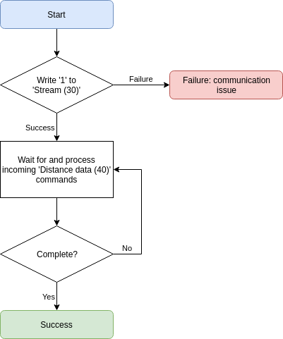

# Serial interface

## Overview

3V to 5V compat? The LW316 has a fixed Baudrate of 921600, which is required for the data streaming. Future versions of firmware will allow a selectable baud rate.
Use packets to communicate, see: 

Communication over this interface is strictly done with encapsulated packets.

Request/response vs streaming.
Reading and writing are set with a bit in the binary request packet.

Read vs Writing.

Response recevied when read/write

## Packets

A serial communication packet, whether receving or transmitting, is composed of the following bytes:

| Name | Size | Data type | Description |
|------|-------------|------|-----------|
| Start | 1 | uint8 | Always 0xFE |
| Flags | 2 | uint16 | See below for bit representation |
| ID | 1 | uint8 | Command ID |
| Data | N | uint8[N] | Data payload |
| CRC | 2 | uint16 | Checksum of header and payload |

!> `Flags` and `CRC` are 16 bit integers. Their bytes should be in little-endian order (least significant first) when being written into a packet.

The ID byte represents the command to read or write.

The packet always begins with a start byte of 0xFE and is followed by a set of flags as described below:

| 15 .. 6 | 5 .. 1 | 0 |
|---|---|---|
| Packet length: 0 to 1023 | Reserved | Write bit |

!> Note that the packet length includes the ID byte plus the data length.


## Checksum
Some stuff about the crc. CRC 16 CCITT 0x1021

**C/C++**
```c
uint16_t createCRC(uint8_t* Data, uint16_t Size)
{
    uint16_t crc = 0;

    for (uint32_t i = 0; i < Size; ++i)
    {
        uint16_t code = crc >> 8;
        code ^= Data[i];
        code ^= code >> 4;
        crc = crc << 8;
        crc ^= code;
        code = code << 5;
        crc ^= code;
        code = code << 7;
        crc ^= code;
    }

    return crc;
}
```

**Javascript**
```javascript
function createCRC(data, size) {
    let crc = 0;

    for (let i = 0; i < size; ++i) {
        let code = crc >>> 8 & 0xFF;
        code ^= data[i] & 0xFF;
        code ^= code >>> 4;
        crc = crc << 8 & 0xFFFF;
        crc ^= code;
        code = code << 5 & 0xFFFF;
        crc ^= code;
        code = code << 7 & 0xFFFF;
        crc ^= code;
    }

    return crc;
}
```
## Initiate serial interface

Here is the recommended procedure for establishing communication with the LW316:


## Request & response

Here is the recommended procedure for sending a command request and reading the response:


## Packet reading


## Application implementation

Applies to both serial/i2c, more of an overall concept.

